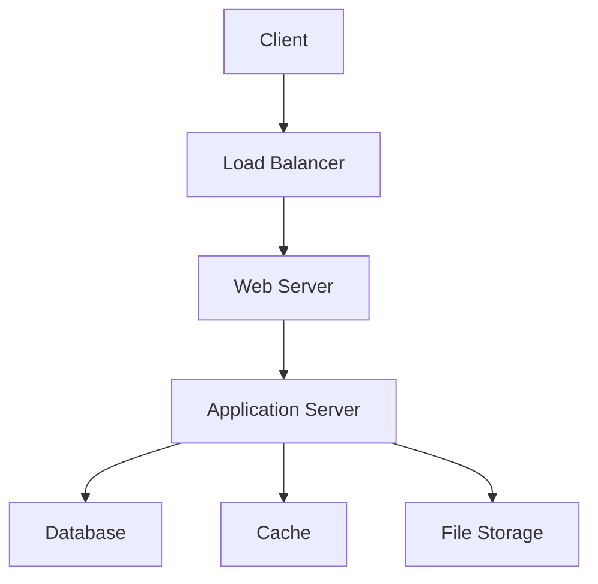

# Tour du Maroc - Plateforme Digitale 🚴‍♂️


[](https://www.php.net)
[](https://www.postgresql.org)
[](https://opensource.org/licenses/MIT)

## 📖 Table des Matières

- [Vue d'ensemble](#vue-densemble)
- [Fonctionnalités](#fonctionnalités)
- [Architecture Technique](#architecture-technique)
- [Installation](#installation)
- [Configuration](#configuration)
- [API Documentation](#api-documentation)
- [Tests](#tests)
- [Déploiement](#déploiement)
- [Contribution](#contribution)
- [Support](#support)
- [Feuille de Route](#feuille-de-route)
- [Licence](#licence)

## Vue d'Ensemble

La plateforme Tour du Maroc est une application web innovante qui révolutionne l'expérience du cyclisme professionnel au Maroc. Elle connecte fans, cyclistes et organisateurs dans un écosystème digital complet.

### 🎯 Objectifs du Projet

- Digitaliser l'expérience du Tour du Maroc
- Créer une communauté engagée autour du cyclisme
- Fournir des outils d'analyse performants pour les cyclistes
- Optimiser la gestion des événements

### 📊 Métriques Clés

- Temps réel de suivi des courses
- Analyses de performance avancées
- Engagement communautaire
- Gestion événementielle

## Fonctionnalités

### 🌟 Fonctionnalités Principales

#### Système Multi-Utilisateurs
```php
// Exemple de structure de rôles
public enum UserRole {
    case VISITOR;
    case FAN;
    case CYCLIST;
    case ADMIN;
}
```

#### Pour les Visiteurs
- 🗺️ Carte interactive des étapes
- 🔍 Recherche avancée avec filtres multiples
- 📊 Tableaux de classement en temps réel
- 🎥 Galerie multimédia

#### Pour les Fans
```javascript
// Exemple de système de notification
class NotificationService {
    async subscribe(userId, stageId) {
        // Logique d'inscription aux notifications
    }
    
    async notify(event) {
        // Système de notification en temps réel
    }
}
```

#### Pour les Cyclistes
- 📈 Dashboard personnalisé
- 🎯 Suivi des performances
- 📊 Analyses comparatives
- 📸 Galerie personnelle

#### Pour les Administrateurs
- 🎛️ Panel d'administration complet
- 📊 Tableaux de bord analytiques
- 🔍 Outils de modération
- 📨 Système de messagerie

### 🔒 Sécurité

```php
// Exemple de middleware d'authentification
class AuthMiddleware {
    public function handle(Request $request, Closure $next) {
        if (!$this->isAuthenticated()) {
            return redirect('/login');
        }
        
        return $next($request);
    }
}
```

## Architecture Technique

### 🏗️ Stack Technique

#### Backend
- **Framework**: PHP 8.x MVC personnalisé
- **Base de données**: PostgreSQL 12+
- **Cache**: Redis
- **API**: RESTful avec JWT
- **Tests**: PHPUnit

#### Frontend
- **Framework**: JavaScript ES6+
- **UI**: Bootstrap 5/TailwindCSS
- **State Management**: Context API
- **Tests**: Jest



### 📦 Structure du Projet

```
tour-maroc/
├── app/
│   ├── Controllers/
│   ├── Models/
│   ├── Services/
│   └── Views/
├── config/
├── database/
├── public/
├── tests/
├── vendor/
└── README.md
```

## Installation

### 🔧 Prérequis

- PHP >= 8.0
- PostgreSQL >= 12
- Composer
- Node.js >= 14
- Redis

### 📥 Installation Locale

```bash
# Cloner le repository
git clone https://github.com/votre-org/tour-maroc.git

# Installer les dépendances PHP
composer install

# Installer les dépendances Node.js
npm install

# Copier le fichier d'environnement
cp .env.example .env

# Générer la clé d'application
php artisan key:generate

# Lancer les migrations
php artisan migrate

# Lancer les seeds
php artisan db:seed

# Compiler les assets
npm run build

# Démarrer le serveur
php artisan serve
```

### 🐳 Installation avec Docker

```bash
# Construire les conteneurs
docker-compose build

# Lancer l'environnement
docker-compose up -d
```

## Configuration

### ⚙️ Variables d'Environnement

```env
# Application
APP_NAME=TourMaroc
APP_ENV=local
APP_KEY=
APP_DEBUG=true
APP_URL=http://localhost

# Database
DB_CONNECTION=pgsql
DB_HOST=127.0.0.1
DB_PORT=5432
DB_DATABASE=tour_maroc
DB_USERNAME=postgres
DB_PASSWORD=

# Redis
REDIS_HOST=127.0.0.1
REDIS_PORT=6379

# Mail
MAIL_MAILER=smtp
MAIL_HOST=mailhog
MAIL_PORT=1025
```

## API Documentation

### 🔌 Endpoints Principaux

```php
// Routes principales
Route::group(['prefix' => 'api/v1'], function () {
    Route::get('/stages', 'StageController@index');
    Route::get('/cyclists', 'CyclistController@index');
    Route::get('/rankings', 'RankingController@index');
});
```

Consultez notre [documentation API complète](docs/api.md) pour plus de détails.

## Tests

### 🧪 Exécution des Tests

```bash
# Tests unitaires
php artisan test

# Tests frontend
npm run test

# Tests E2E
npm run test:e2e
```

## Déploiement

### 📦 Process de Déploiement

1. **Préparation**
   ```bash
   composer install --optimize-autoloader --no-dev
   npm install --production
   ```

2. **Build**
   ```bash
   npm run build
   php artisan config:cache
   php artisan route:cache
   ```

3. **Migration**
   ```bash
   php artisan migrate --force
   ```

## Contribution

### 🤝 Guide de Contribution

1. Fork le projet
2. Créez votre branche (`git checkout -b feature/AmazingFeature`)
3. Committez vos changements (`git commit -m 'Add AmazingFeature'`)
4. Push vers la branche (`git push origin feature/AmazingFeature`)
5. Ouvrez une Pull Request

### 📝 Standards de Code

- PSR-12 pour PHP
- ESLint pour JavaScript
- Prettier pour le formatage

## Support

### 🆘 Obtenir de l'Aide

- 📧 Email: support@tourmaroc.ma
- 💬 Discord: [Tour du Maroc Community](https://discord.gg/tourmaroc)
- 📚 Wiki: [Documentation](https://wiki.tourmaroc.ma)

## Feuille de Route

### 📅 Prochaines Étapes

- [ ] Intégration de l'analyse vidéo en temps réel
- [ ] Système de prédiction des performances
- [ ] Application mobile native
- [ ] Intégration IoT pour le suivi des cyclistes

## Licence

Ce projet est sous licence MIT. Voir le fichier [LICENSE](LICENSE) pour plus de détails.

## 🙏 Remerciements

- Fédération Marocaine de Cyclisme
- Équipe de développement
- Contributeurs open source
- Communauté cycliste marocaine

---

Développé avec ❤️ pour la communauté cycliste marocaine